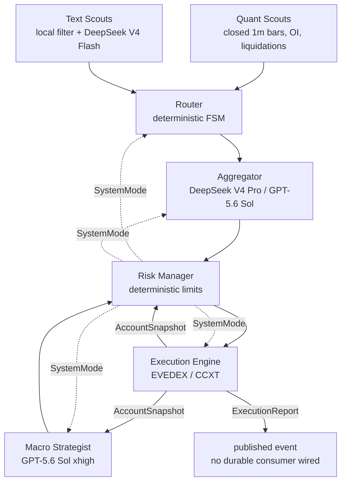

# Kairos — AI Futures Trader

Kairos is a pre-production, LLM-assisted futures-trading system with deterministic risk
guards. Models receive compact typed context, never raw streams, and cannot call an exchange.
Every order must be approved by the Risk Manager and submitted by the Execution Engine.



## The one rule

**The LLM never trades directly and never works with a raw stream of numbers.** It analyzes
validated, compressed context. Deterministic code owns sizing, limits, degradation modes,
exchange authentication, reconciliation, and execution.

## Repositories

| repository | role |
| --- | --- |
| [kairos-core](https://github.com/Kairos-cryptoAI/kairos-core) | typed contracts, Redis Streams bus, config and logging |
| [kairos-llm](https://github.com/Kairos-cryptoAI/kairos-llm) | OpenAI Responses / DeepSeek gateway, strict output validation, cost and health events |
| [kairos-quant-scouts](https://github.com/Kairos-cryptoAI/kairos-quant-scouts) | closed-bar market indicators, open interest and liquidation aggregation |
| [kairos-text-scouts](https://github.com/Kairos-cryptoAI/kairos-text-scouts) | text ingestion, local filtering, sentiment and local fallback |
| [kairos-router](https://github.com/Kairos-cryptoAI/kairos-router) | deterministic routing FSM and hysteresis |
| [kairos-aggregator](https://github.com/Kairos-cryptoAI/kairos-aggregator) | tactical decisions with strict schemas |
| [kairos-macro-strategist](https://github.com/Kairos-cryptoAI/kairos-macro-strategist) | strategic allocation, shock detection and account-aware context |
| [kairos-risk-manager](https://github.com/Kairos-cryptoAI/kairos-risk-manager) | account-aware risk checks, sizing and system circuit breaker |
| [kairos-execution-engine](https://github.com/Kairos-cryptoAI/kairos-execution-engine) | EVEDEX/CCXT adapters, reconciliation and account snapshots |
| [kairos-persistence](https://github.com/Kairos-cryptoAI/kairos-persistence) | Timescale migrations and transactional inbox/outbox primitives |
| [kairos-backtest](https://github.com/Kairos-cryptoAI/kairos-backtest) | deterministic historical replay and fill modelling |
| [kairos-deploy](https://github.com/Kairos-cryptoAI/kairos-deploy) | pinned deployment manifest, containers and monitoring configuration |
| [kairos](https://github.com/Kairos-cryptoAI/kairos) | architecture, ADRs and cross-repository verification |

## Windows-first local verification

The meta-repository runner discovers `uv`, reads [`config/repositories.json`](config/repositories.json),
and verifies every Python repository without Docker or live credentials. It does not read
`.env` files, change Git state, or clean dirty worktrees.

```powershell
Set-Location D:\Kairos\kairos

# Full 3.11 + 3.14 matrix for all Python repositories.
powershell.exe -NoProfile -ExecutionPolicy Bypass -File .\scripts\Test-Kairos.ps1

# Faster focused iteration.
powershell.exe -NoProfile -ExecutionPolicy Bypass -File .\scripts\Test-Kairos.ps1 `
  -Repository kairos-core,kairos-router -PythonVersion 3.11 -FailFast

# Validate only the manifest and execution plan.
powershell.exe -NoProfile -ExecutionPolicy Bypass -File .\scripts\Test-Kairos.ps1 -ValidateOnly
```

For each selected Python version, the runner performs locked dependency checks, Ruff lint and
format checks, mypy, Bandit, network-free pytest, and a package build. Persistence integration
tests that require TimescaleDB are deliberately excluded from this Docker-free pass.

## Current delivery state

As of 2026-08-12, the modernization work is carried in draft pull requests across the eleven
Python repositories, and their GitHub Python 3.11/3.14 plus Windows CI matrices are green.
Cross-repository Git dependencies use full commit SHAs and `uv.lock`; merge order still matters.

This is **not production-ready**. The transactional inbox/outbox package is not yet wired into
every service runtime, important replay/account histories are still process-local, and external
live EVEDEX/provider/canary testing remains outstanding. See [project status](docs/STATUS.md)
for the full readiness boundary.

See [architecture](docs/ARCHITECTURE.md), the [ADRs](docs/adr/) and
[budget assumptions](docs/BUDGET.md). MIT licensed.
