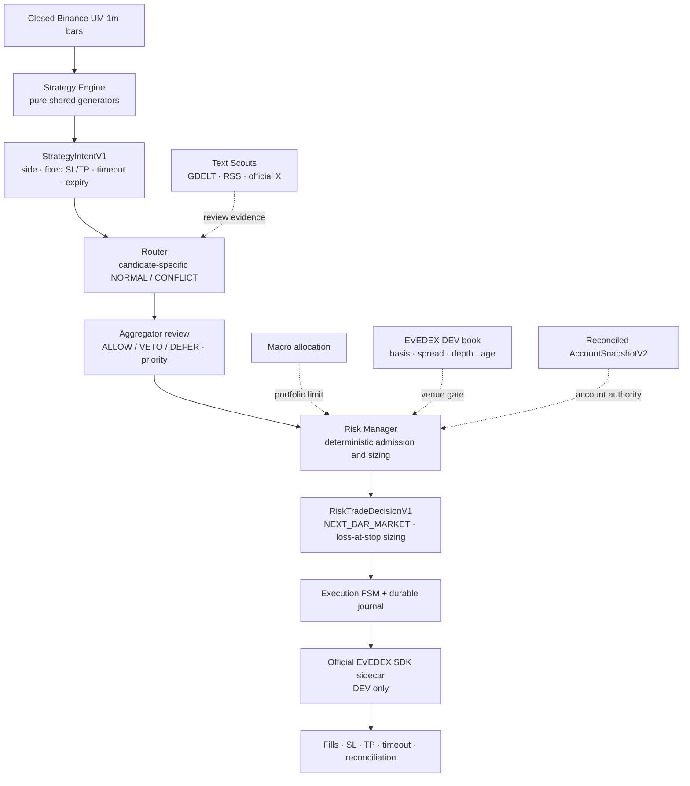

# Kairos — AI Futures Trader

Kairos is a pre-production, LLM-assisted futures-trading system with deterministic strategy,
risk and execution boundaries. Models receive compact typed context, never raw streams, cannot
change a strategy's side or exit plan, and cannot call an exchange. Every PAPER mutation must
come from an immutable strategy intent, pass deterministic risk and EVEDEX DEV venue gates, and
be submitted by the crash-recoverable Execution Engine.

### Strategy Parity → EVEDEX DEV PAPER



The Strategy Engine is the one source of candidate logic for both offline replay and runtime.
The Aggregator may review an intent, but cannot mutate it; `VETO`, `DEFER`, a timeout or an error
ends that intent. Risk alone calculates quantity from worst-case loss at the fixed stop and
checks Macro allocation, the reconciled account, one-position-per-symbol policy and fresh venue
quality. Execution alone owns exchange effects and recovery.

The legacy `TacticalCommand -> ValidatedOrder` route is retained only for explicit synthetic
`DRY_RUN`. PAPER never consumes it, `KAIROS_DRY_RUN=false` is a startup error, and LIVE is
disabled.

## The one rule

**The LLM never trades directly and never works with a raw stream of numbers.** It analyzes
validated, compressed context. Candidate review is limited to `ALLOW`, `VETO`, `DEFER` and
priority. Deterministic code owns candidate parameters, sizing, limits, degradation modes,
exchange authentication, reconciliation, and execution.

## Repositories

| repository | role |
| --- | --- |
| [kairos-core](https://github.com/Kairos-cryptoAI/kairos-core) | typed contracts, Redis Streams bus, config and logging |
| [kairos-llm](https://github.com/Kairos-cryptoAI/kairos-llm) | OpenAI Responses / DeepSeek gateway, strict output validation, cost and health events |
| [kairos-quant-scouts](https://github.com/Kairos-cryptoAI/kairos-quant-scouts) | complete closed Binance bars, gap recovery, indicators and EVEDEX quality polling |
| [kairos-strategy-engine](https://github.com/Kairos-cryptoAI/kairos-strategy-engine) | pure strategy generators shared byte-for-byte by research and runtime |
| [kairos-text-scouts](https://github.com/Kairos-cryptoAI/kairos-text-scouts) | text ingestion, local filtering, sentiment and local fallback |
| [kairos-router](https://github.com/Kairos-cryptoAI/kairos-router) | candidate-specific deterministic NORMAL/CONFLICT routing plus legacy DRY_RUN FSM |
| [kairos-aggregator](https://github.com/Kairos-cryptoAI/kairos-aggregator) | immutable `ALLOW/VETO/DEFER` candidate review plus legacy DRY_RUN tactical decisions |
| [kairos-macro-strategist](https://github.com/Kairos-cryptoAI/kairos-macro-strategist) | strategic allocation, shock detection and account-aware context |
| [kairos-risk-manager](https://github.com/Kairos-cryptoAI/kairos-risk-manager) | loss-at-stop sizing and deterministic account, portfolio and venue admission |
| [kairos-execution-engine](https://github.com/Kairos-cryptoAI/kairos-execution-engine) | EVEDEX DEV SDK sidecar, protected PAPER lifecycle, reconciliation and effect journal |
| [kairos-persistence](https://github.com/Kairos-cryptoAI/kairos-persistence) | Timescale inbox/outbox, facts, lifecycle, TCA, budgets, equity and readiness metrics |
| [kairos-backtest](https://github.com/Kairos-cryptoAI/kairos-backtest) | deterministic replay using the exact Strategy Engine generators and fill modelling |
| [kairos-deploy](https://github.com/Kairos-cryptoAI/kairos-deploy) | pinned DRY_RUN and isolated `kairos-paper` Compose projects, monitoring and recovery tools |
| [kairos](https://github.com/Kairos-cryptoAI/kairos) | architecture, ADRs and cross-repository verification |

## Windows-first local verification

The meta-repository runner discovers `uv`, reads [`config/repositories.json`](config/repositories.json),
and verifies every repository in that manifest without Docker or live credentials. It does not read
`.env` files, change Git state, or clean dirty worktrees.

```powershell
Set-Location D:\Kairos\kairos

# Full 3.11 + 3.14 matrix for repositories listed in the manifest.
powershell.exe -NoProfile -ExecutionPolicy Bypass -File .\scripts\Test-Kairos.ps1

# Faster focused iteration.
powershell.exe -NoProfile -ExecutionPolicy Bypass -File .\scripts\Test-Kairos.ps1 `
  -Repository kairos-core,kairos-router -PythonVersion 3.11 -FailFast

# Validate only the manifest and execution plan.
powershell.exe -NoProfile -ExecutionPolicy Bypass -File .\scripts\Test-Kairos.ps1 -ValidateOnly
```

For each selected Python version, the runner performs locked dependency checks, Ruff lint and
format checks, mypy, Bandit, network-free pytest, and a package build. Persistence integration
tests that require TimescaleDB are deliberately excluded from this Docker-free pass.

## Offline strategy promotion gate

The frozen validation candidate is `confirmation_bars=12`, `minimum_hold_bars=48`, and
`minimum_confidence=0.67`. It was replayed against official Binance Futures monthly 1m
archives admitted through SHA-256 sidecar and ZIP CRC checks: a 12-month research interval and
an untouched July holdout. Execution is causal: a signal formed from closed data is eligible at
the first subsequent candle open, and its liquidity cap uses only the previous closed candle's
volume.

| evidence | baseline | stress |
| --- | ---: | ---: |
| 12-month research replay | -4.231727849843687% / 803 trades | -9.763199273155571% / 804 trades |
| untouched July promotion OOS | -1.075965871769744% / 69 trades | -1.5781050811020259% / 69 trades |

The rolling folds are post-selection temporal diagnostics, **not** out-of-sample promotion
evidence. Only untouched July is promotion OOS. It returned below the +6.828606504564661%
buy-and-hold benchmark, and zero of five symbols were positive. Actual historical funding was
unavailable, so it is disclosed rather than silently substituted.

The fail-closed result is `needs_revision` with `real_api_allowed=false`. Current blockers are
insufficient OOS trades, non-positive return and expectancy, benchmark underperformance,
unavailable historical funding, non-positive sensitivity results, and upstream data
anomalies/gaps/incomplete coverage. This backtest is research evidence only; it is not live-stack,
venue, or production qualification. See
[ADR 9](docs/adr/0009-offline-strategy-promotion-gate.md) for the decision boundary.

A subsequent development-only order-flow screen tested three mutually exclusive taker-flow
hypotheses on reused July-December 2022 research data. The highest-frequency `PERSISTENCE`
variant produced 387 baseline and 301 stress trades, but returned -2.9005% and -3.2540%; all six
trial/scenario cells had negative expectancy and profit factor below 1.0. Its decision is
`REJECT_ALL`, with every promotion, shadow and live permission still false. This result shows
that trade frequency is no longer the main blocker—the standalone flow-continuation signal lacks
net edge. It does not replace or upgrade the frozen promotion evidence. See the
[order-flow screen report](https://github.com/Kairos-cryptoAI/kairos-backtest/blob/main/reports/orderflow-screen/REPORT.md).

A third frozen, development-only regime/retest screen evaluated structural reclaim, flow
reacceleration and absorption reclaim on reused December 2023-June 2024 `RESEARCH/FIT` data.
Its stacked funnel reduced 41,741 breakout candidates to 12 structural intents, two
flow-reacceleration intents and no absorption intents; only one baseline trade executed and
stress admitted none. The XRPUSDT trade lost $15.49 net (-0.015492%, -1.63R), and every required
frequency and positive-economics gate failed. The decision is `REJECT_ALL`; promotion, shadow
operation, live trading and real API use remain disabled. Trials 7-9 are consumed and must not
be rerun or retuned against this interval. This does not alter the frozen promotion evidence.
See the [regime-retest screen report](https://github.com/Kairos-cryptoAI/kairos-backtest/blob/main/reports/regime-retest-screen/REPORT.md).

## Current delivery state

As of 2026-08-23, the strict Strategy Parity/PAPER code path is implemented on `main`: complete
closed-bar handling, shared pure generators, immutable review, deterministic loss-at-stop risk,
runtime EVEDEX quality measurements, a protected trade FSM, durable effect/lifecycle facts,
an official SDK sidecar and an isolated `kairos-paper` deployment. Cross-repository dependencies
and deployment sources are pinned to full commits.

The readiness flags deliberately describe different claims:

| flag | value | exact meaning |
| --- | --- | --- |
| `TECHNICAL_PAPER_READY` | `true` | code and integration readiness for the exact reviewed revision set after its Windows, Docker and GitHub CI gates |
| `PAPER_QUALIFIED` | `false` | real DEV auth, 24-hour observation, five-symbol canary evidence and seven-day soak are not complete |
| `ALPHA_READY` | `false` | every current strategy sleeve remains rejected; automatic strategy PAPER is disabled |
| `LIVE_READY` | `false` | LIVE startup and production credentials/endpoints remain blocked |

`TECHNICAL_PAPER_READY=true` is not an exchange-performance or profitability claim. The current
maximum permitted operation is read-only EVEDEX DEV observation. A technical canary may be armed
manually only after the 24-hour gate passes, and it does not promote alpha. See the exact revision
matrix and qualification ladder in [PAPER readiness](docs/READINESS.md).

Historical bounded provider probes remain unchanged: X authenticated once and returned one User
plus ten Posts for `$0.060000`, but every Post was older than the 30-minute freshness gate; one
structured-output probe passed each configured DeepSeek/OpenAI route for about `$0.00237938`
modeled cost. Those samples are not a latency, quota, availability or quality soak, and no order
was made. Technical EVEDEX canaries start no paid LLM/feed services.

This is still **not production-ready**. `REJECT_ALL` remains authoritative until a new strategy
revision passes the offline promotion gate. Authenticated EVEDEX semantics, elapsed operational
gates, paid shadow qualification and a future managed KMS/Vault boundary remain outstanding.

See [architecture](docs/ARCHITECTURE.md), [project status](docs/STATUS.md), the
[ADRs](docs/adr/) and [budget assumptions](docs/BUDGET.md). MIT licensed.
