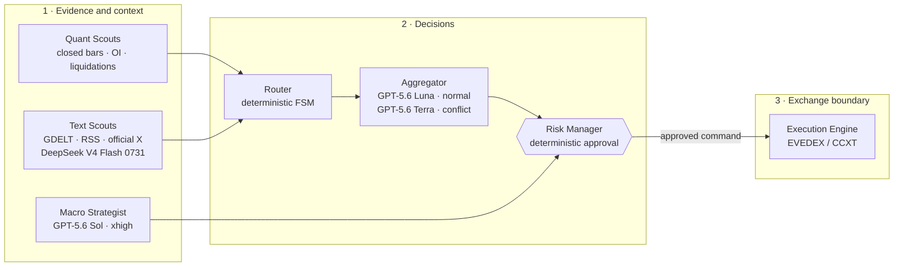
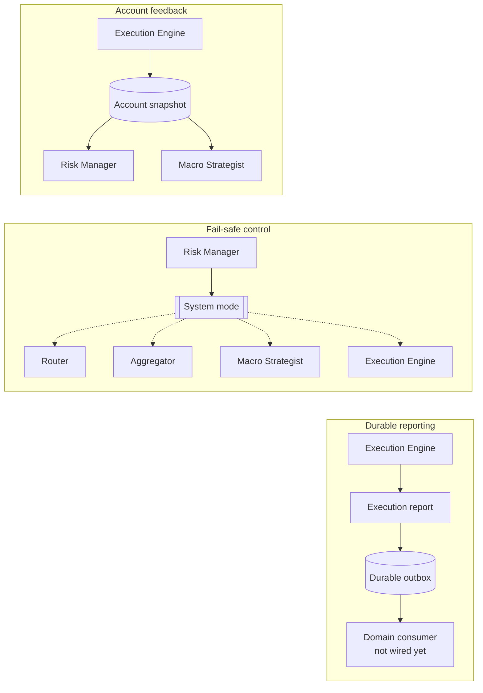

# Kairos — AI Futures Trader

Kairos is a pre-production, LLM-assisted futures-trading system with deterministic risk
guards. Models receive compact typed context, never raw streams, and cannot call an exchange.
Every order must be approved by the Risk Manager and submitted by the Execution Engine.

### Decision and execution path



Models enrich or interpret evidence, but only deterministic components can approve and submit
an order. A command rejected by the Risk Manager never reaches the exchange adapter.

### Feedback, safety and durability



Solid arrows carry state or reports. Dashed arrows are fail-safe mode broadcasts. Account
snapshots close the reconciliation loop; execution reports are durable even though their
downstream domain consumer is still pending. Repeated service names refer to the same running
components; each row isolates one relationship to keep the diagram readable.

## The one rule

**The LLM never trades directly and never works with a raw stream of numbers.** It analyzes
validated, compressed context. Deterministic code owns sizing, limits, degradation modes,
exchange authentication, reconciliation, and execution.

## Repositories

| repository | role |
| --- | --- |
| [kairos-core](https://github.com/Kairos-cryptoAI/kairos-core) | typed contracts, Redis Streams bus, config and logging |
| [kairos-llm](https://github.com/Kairos-cryptoAI/kairos-llm) | OpenAI Responses / DeepSeek gateway, strict output validation, cost and health events |
| [kairos-quant-scouts](https://github.com/Kairos-cryptoAI/kairos-quant-scouts) | closed-bar market indicators, open interest and liquidation aggregation |
| [kairos-text-scouts](https://github.com/Kairos-cryptoAI/kairos-text-scouts) | text ingestion, local filtering, sentiment and local fallback |
| [kairos-router](https://github.com/Kairos-cryptoAI/kairos-router) | deterministic routing FSM and hysteresis |
| [kairos-aggregator](https://github.com/Kairos-cryptoAI/kairos-aggregator) | tactical decisions with strict schemas |
| [kairos-macro-strategist](https://github.com/Kairos-cryptoAI/kairos-macro-strategist) | strategic allocation, shock detection and account-aware context |
| [kairos-risk-manager](https://github.com/Kairos-cryptoAI/kairos-risk-manager) | account-aware risk checks, sizing and system circuit breaker |
| [kairos-execution-engine](https://github.com/Kairos-cryptoAI/kairos-execution-engine) | EVEDEX/CCXT adapters, reconciliation, durable effect journal and account snapshots |
| [kairos-persistence](https://github.com/Kairos-cryptoAI/kairos-persistence) | Timescale migrations, runtime inbox/outbox, execution journal and metrics |
| [kairos-backtest](https://github.com/Kairos-cryptoAI/kairos-backtest) | deterministic historical replay and fill modelling |
| [kairos-deploy](https://github.com/Kairos-cryptoAI/kairos-deploy) | pinned deployment manifest, containers and monitoring configuration |
| [kairos](https://github.com/Kairos-cryptoAI/kairos) | architecture, ADRs and cross-repository verification |

## Windows-first local verification

The meta-repository runner discovers `uv`, reads [`config/repositories.json`](config/repositories.json),
and verifies every Python repository without Docker or live credentials. It does not read
`.env` files, change Git state, or clean dirty worktrees.

```powershell
Set-Location D:\Kairos\kairos

# Full 3.11 + 3.14 matrix for all Python repositories.
powershell.exe -NoProfile -ExecutionPolicy Bypass -File .\scripts\Test-Kairos.ps1

# Faster focused iteration.
powershell.exe -NoProfile -ExecutionPolicy Bypass -File .\scripts\Test-Kairos.ps1 `
  -Repository kairos-core,kairos-router -PythonVersion 3.11 -FailFast

# Validate only the manifest and execution plan.
powershell.exe -NoProfile -ExecutionPolicy Bypass -File .\scripts\Test-Kairos.ps1 -ValidateOnly
```

For each selected Python version, the runner performs locked dependency checks, Ruff lint and
format checks, mypy, Bandit, network-free pytest, and a package build. Persistence integration
tests that require TimescaleDB are deliberately excluded from this Docker-free pass.

## Offline strategy promotion gate

The frozen validation candidate is `confirmation_bars=12`, `minimum_hold_bars=48`, and
`minimum_confidence=0.67`. It was replayed against official Binance Futures monthly 1m
archives admitted through SHA-256 sidecar and ZIP CRC checks: a 12-month research interval and
an untouched July holdout. Execution is causal: a signal formed from closed data is eligible at
the first subsequent candle open, and its liquidity cap uses only the previous closed candle's
volume.

| evidence | baseline | stress |
| --- | ---: | ---: |
| 12-month research replay | -4.231727849843687% / 803 trades | -9.763199273155571% / 804 trades |
| untouched July promotion OOS | -1.075965871769744% / 69 trades | -1.5781050811020259% / 69 trades |

The rolling folds are post-selection temporal diagnostics, **not** out-of-sample promotion
evidence. Only untouched July is promotion OOS. It returned below the +6.828606504564661%
buy-and-hold benchmark, and zero of five symbols were positive. Actual historical funding was
unavailable, so it is disclosed rather than silently substituted.

The fail-closed result is `needs_revision` with `real_api_allowed=false`. Current blockers are
insufficient OOS trades, non-positive return and expectancy, benchmark underperformance,
unavailable historical funding, non-positive sensitivity results, and upstream data
anomalies/gaps/incomplete coverage. This backtest is research evidence only; it is not live-stack,
venue, or production qualification. See
[ADR 9](docs/adr/0009-offline-strategy-promotion-gate.md) for the decision boundary.

A subsequent development-only order-flow screen tested three mutually exclusive taker-flow
hypotheses on reused July-December 2022 research data. The highest-frequency `PERSISTENCE`
variant produced 387 baseline and 301 stress trades, but returned -2.9005% and -3.2540%; all six
trial/scenario cells had negative expectancy and profit factor below 1.0. Its decision is
`REJECT_ALL`, with every promotion, shadow and live permission still false. This result shows
that trade frequency is no longer the main blocker—the standalone flow-continuation signal lacks
net edge. It does not replace or upgrade the frozen promotion evidence. See the
[order-flow screen report](https://github.com/Kairos-cryptoAI/kairos-backtest/blob/main/reports/orderflow-screen/REPORT.md).

A third frozen, development-only regime/retest screen evaluated structural reclaim, flow
reacceleration and absorption reclaim on reused December 2023-June 2024 `RESEARCH/FIT` data.
Its stacked funnel reduced 41,741 breakout candidates to 12 structural intents, two
flow-reacceleration intents and no absorption intents; only one baseline trade executed and
stress admitted none. The XRPUSDT trade lost $15.49 net (-0.015492%, -1.63R), and every required
frequency and positive-economics gate failed. The decision is `REJECT_ALL`; promotion, shadow
operation, live trading and real API use remain disabled. Trials 7-9 are consumed and must not
be rerun or retuned against this interval. This does not alter the frozen promotion evidence.
See the [regime-retest screen report](https://github.com/Kairos-cryptoAI/kairos-backtest/blob/main/reports/regime-retest-screen/REPORT.md).

## Current delivery state

As of 2026-08-18, the modernization and durable-runtime work is merged into `main` across all thirteen
repositories. The Python 3.11/3.14, Windows, integration and deployment image-build matrices
are green. Cross-repository Git dependencies use full commits that are retained in `main`
history and recorded in `uv.lock`; future dependency updates must still repin consumers and
deployment inputs in dependency order.

All runtime services now use the transactional inbox/outbox path before Redis ACK; Execution
journals venue mutations before submission and reconciles unresolved effects before accepting
new risk. The Docker operations stack uses file-scoped secrets, durable-state metrics and
alerts, and has passed local Redis reconnect plus backup/restore drills.

Text Scouts now uses the official X API rather than Bright Data. It resolves each configured
handle once, durably caches the immutable User ID, then polls User Posts with durable Post
cursors and transactional monthly spend reservations. The Bearer Token is file-mounted and
was accepted by X. A single funded probe read one User and ten Posts for `$0.060000`; all Posts
were older than the 30-minute freshness gate, so feed qualification remains incomplete. One
bounded structured-output call also passed on each configured DeepSeek/OpenAI model route for
about `$0.00237938` modeled cost. No order was made.

This is still **not production-ready**. Authenticated EVEDEX semantics, long-duration
Binance/EVEDEX basis and liquidity, paid LLM/feed availability tails, quotas and quality,
an approved paid shadow schedule, external secret-manager deployment, and a substantially longer
soak/canary remain unqualified. Provider-wide LLM and X spend ceilings are now enforced through
durable pre-call reservations. Strategy promotion also
remains denied independently. See [project status](docs/STATUS.md) for the full readiness boundary.

See [architecture](docs/ARCHITECTURE.md), the [ADRs](docs/adr/) and
[budget assumptions](docs/BUDGET.md). MIT licensed.
