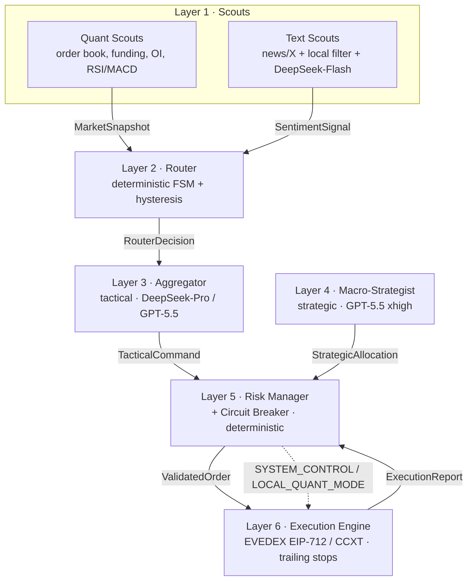

# Kairos — AI Futures Trader

> An LLM-directed, **deterministically-guarded** futures trading system. The model is the
> analytical *brain* that tunes hard-coded math strategies — it never touches the exchange
> and never sees raw number streams. Trades on [EVEDEX](https://exchange.evedex.com/);
> testable on Binance / other venues via CCXT.



## The one rule
**The LLM never trades directly and never works with a raw stream of numbers.** It only
receives structured, compressed, pre-validated data, and all critical actions pass through
deterministic risk filters and are executed by a separate engine.

## Repositories
| repo | layer / role |
| --- | --- |
| [kairos-core](https://github.com/TheLitis/kairos-core) | shared contracts, message bus, config, logging |
| [kairos-llm](https://github.com/TheLitis/kairos-llm) | LLM gateway: effort→model routing, cost accounting, breaker hooks |
| [kairos-quant-scouts](https://github.com/TheLitis/kairos-quant-scouts) | **1A** — market data + indicators → `MarketSnapshot` |
| [kairos-text-scouts](https://github.com/TheLitis/kairos-text-scouts) | **1B** — news/X + local filter + LLM sentiment |
| [kairos-router](https://github.com/TheLitis/kairos-router) | **2** — FSM + hysteresis (`USE_MEDIUM`/`USE_HIGH`) |
| [kairos-aggregator](https://github.com/TheLitis/kairos-aggregator) | **3** — tactical decisions (medium/high) |
| [kairos-macro-strategist](https://github.com/TheLitis/kairos-macro-strategist) | **4** — strategic allocation (xhigh) |
| [kairos-risk-manager](https://github.com/TheLitis/kairos-risk-manager) | **5** — risk filters + circuit breaker |
| [kairos-execution-engine](https://github.com/TheLitis/kairos-execution-engine) | **6** — EVEDEX/CCXT execution + trailing stops |
| [kairos-deploy](https://github.com/TheLitis/kairos-deploy) | docker-compose, TimescaleDB, monitoring |

## Architecture guarantees
- The LLM has **no direct access** to the exchange API.
- Raw market data is aggregated to **compact JSON** before any model sees it.
- API cost is controlled by the **Router** (cheap-by-default, expensive only on conflict).
- **Risk filters run independently** of the model.
- **Execution is separated** from analysis.
- On failure, the system drops into a **local protective mode** (`LOCAL_QUANT_MODE`).

## Quick start
```bash
git clone https://github.com/TheLitis/kairos-deploy.git && cd kairos-deploy
make clone                 # clone all sibling repos
cp .env.example .env       # add your OpenAI key; DRY_RUN stays true
make build && make up
```

See [`docs/ARCHITECTURE.md`](docs/ARCHITECTURE.md), the [ADRs](docs/adr/) and
[`docs/BUDGET.md`](docs/BUDGET.md). Influenced by ideas from
[Hummingbot](https://github.com/hummingbot/hummingbot) (connector/executor separation).

— MIT licensed.
