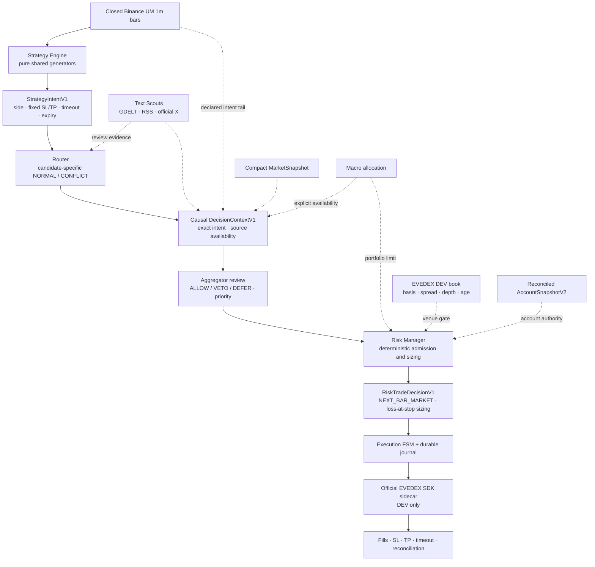

# Kairos — AI Futures Trader

Kairos is a pre-production, LLM-assisted futures-trading system with deterministic strategy,
risk and execution boundaries. Models receive compact typed context, never raw streams, cannot
change a strategy's side or exit plan, and cannot call an exchange. Every PAPER mutation must
come from an immutable strategy intent, pass deterministic risk and EVEDEX DEV venue gates, and
be submitted by the crash-recoverable Execution Engine.

Current scope and implementation priorities are defined in
[CURRENT_CONCEPT.md](docs/CURRENT_CONCEPT.md). The diagram below describes the
candidate contract path, not an accepted continuously running adaptive deployment.
The existing PAPER Compose profile is a bounded technical DEV-canary profile.

### Strategy Parity → EVEDEX DEV PAPER


```mermaid
flowchart TB
    B["Closed Binance UM 1m bars"] --> S["Strategy Engine<br/>pure shared generators"]
    S --> I["StrategyIntentV1<br/>side · fixed SL/TP · timeout · expiry"]
    I --> R["Router<br/>candidate-specific NORMAL / CONFLICT"]
    R --> Q["Causal DecisionContextV1<br/>exact intent · source availability"]
    Q --> A["Aggregator review<br/>ALLOW / VETO / DEFER · priority"]
    A --> K["Risk Manager<br/>deterministic admission and sizing"]
    K --> D["RiskTradeDecisionV1<br/>NEXT_BAR_MARKET · loss-at-stop sizing"]
    D --> E["Execution FSM + durable journal"]
    E --> G["Official EVEDEX SDK sidecar<br/>DEV only"]
    G --> O["Fills · SL · TP · timeout · reconciliation"]

    T["Text Scouts<br/>GDELT · RSS · official X"] -. "review evidence" .-> R
    T -.-> Q
    B -. "declared intent tail" .-> Q
    P["Compact MarketSnapshot"] -.-> Q
    M["Macro allocation"] -. "portfolio limit" .-> K
    M -. "explicit availability" .-> Q
    V["EVEDEX DEV book<br/>basis · spread · depth · age"] -. "venue gate" .-> K
    C["Reconciled AccountSnapshotV2"] -. "account authority" .-> K
```

The Strategy Engine is the one source of candidate logic for both offline replay and runtime.
The Aggregator may review an intent, but cannot mutate it; `VETO`, `DEFER`, a timeout or an error
ends that intent. Risk alone calculates quantity from worst-case loss at the fixed stop and
checks Macro allocation, the reconciled account, one-position-per-symbol policy and fresh venue
quality. Execution alone owns exchange effects and recovery.

Runtime strategy evaluations now distinguish a valid no-trade decision from
warmup, disabled or unavailable/error outcomes. Candidate review requires
immutable source-bound context; missing required evidence defers before a paid
call. The optional regime/capital policy binds strategy, detector, intent and
account identity without changing legacy defaults or admitting a strategy.

One new concrete strategy is implemented: `adaptive_pullback_range_v1`, with
trend pullbacks, range reclaims and a defensive crash overlay. It is an opt-in
research adapter, not enrolled in the trading service or economically qualified.
The [strategy receipt](docs/ADAPTIVE-STRATEGY-2026-10-06.md) records exact rules,
source pins, tests and remaining economic/campaign gates. Trial 15 is unchanged.

The legacy `TacticalCommand -> ValidatedOrder` route is retained only for explicit synthetic
`DRY_RUN`. PAPER never consumes it, `KAIROS_DRY_RUN=false` is a startup error, and LIVE is
disabled.

## The one rule

**The LLM never trades directly and never works with a raw stream of numbers.** It analyzes
validated, compressed context. Candidate review is limited to `ALLOW`, `VETO`, `DEFER` and
priority. Deterministic code owns candidate parameters, sizing, limits, degradation modes,
exchange authentication, reconciliation, and execution.

An independent LLM market hypothesis can be recorded when the strategy emits
no intent or disagrees on direction, but it remains SIM-only research evidence;
it cannot reverse an intent or place a trade. The [adaptive decision research
note](docs/ADAPTIVE-DECISION-RESEARCH-2026-09-28.md) describes the paired ledger
and the missing evaluation gates.

## Repositories

| repository | role |
| --- | --- |
| [kairos-core](https://github.com/Kairos-cryptoAI/kairos-core) | typed contracts, Redis Streams bus, config and logging |
| [kairos-llm](https://github.com/Kairos-cryptoAI/kairos-llm) | OpenAI Responses / DeepSeek gateway, strict output validation, cost and health events |
| [kairos-quant-scouts](https://github.com/Kairos-cryptoAI/kairos-quant-scouts) | complete closed Binance bars, gap recovery, indicators and EVEDEX quality polling |
| [kairos-strategy-engine](https://github.com/Kairos-cryptoAI/kairos-strategy-engine) | pure strategy generators shared byte-for-byte by research and runtime |
| [kairos-text-scouts](https://github.com/Kairos-cryptoAI/kairos-text-scouts) | text ingestion, local filtering, sentiment and local fallback |
| [kairos-router](https://github.com/Kairos-cryptoAI/kairos-router) | candidate-specific deterministic NORMAL/CONFLICT routing plus legacy DRY_RUN FSM |
| [kairos-aggregator](https://github.com/Kairos-cryptoAI/kairos-aggregator) | immutable `ALLOW/VETO/DEFER` candidate review plus legacy DRY_RUN tactical decisions |
| [kairos-macro-strategist](https://github.com/Kairos-cryptoAI/kairos-macro-strategist) | strategic allocation, shock detection and account-aware context |
| [kairos-risk-manager](https://github.com/Kairos-cryptoAI/kairos-risk-manager) | loss-at-stop sizing and deterministic account, portfolio and venue admission |
| [kairos-execution-engine](https://github.com/Kairos-cryptoAI/kairos-execution-engine) | EVEDEX DEV SDK sidecar, protected PAPER lifecycle, reconciliation and effect journal |
| [kairos-persistence](https://github.com/Kairos-cryptoAI/kairos-persistence) | Timescale inbox/outbox, facts, lifecycle, TCA, budgets, equity and readiness metrics |
| [kairos-backtest](https://github.com/Kairos-cryptoAI/kairos-backtest) | deterministic replay using the exact Strategy Engine generators and fill modelling |
| [kairos-deploy](https://github.com/Kairos-cryptoAI/kairos-deploy) | pinned DRY_RUN and isolated `kairos-paper` Compose projects, monitoring and recovery tools |
| [kairos](https://github.com/Kairos-cryptoAI/kairos) | architecture, ADRs and cross-repository verification |

## Windows-first local verification

The meta-repository runner discovers `uv`, reads [`config/repositories.json`](config/repositories.json),
and verifies every repository in that manifest without Docker or live credentials. It does not read
`.env` files, change Git state, or clean dirty worktrees.

```powershell
Set-Location D:\Kairos\kairos

# Full 3.11 + 3.14 matrix for repositories listed in the manifest.
powershell.exe -NoProfile -ExecutionPolicy Bypass -File .\scripts\Test-Kairos.ps1

# Faster focused iteration.
powershell.exe -NoProfile -ExecutionPolicy Bypass -File .\scripts\Test-Kairos.ps1 `
  -Repository kairos-core,kairos-router -PythonVersion 3.11 -FailFast

# Validate only the manifest and execution plan.
powershell.exe -NoProfile -ExecutionPolicy Bypass -File .\scripts\Test-Kairos.ps1 -ValidateOnly
```

For each selected Python version, the runner performs locked dependency checks, Ruff lint and
format checks, mypy, Bandit, network-free pytest, and a package build. Persistence integration
tests that require TimescaleDB are deliberately excluded from this Docker-free pass.

## Offline strategy promotion gate

The frozen validation candidate is `confirmation_bars=12`, `minimum_hold_bars=48`, and
`minimum_confidence=0.67`. It was replayed against official Binance Futures monthly 1m
archives admitted through SHA-256 sidecar and ZIP CRC checks: a 12-month research interval and
an untouched July holdout. Execution is causal: a signal formed from closed data is eligible at
the first subsequent candle open, and its liquidity cap uses only the previous closed candle's
volume.

| evidence | baseline | stress |
| --- | ---: | ---: |
| 12-month research replay | -4.231727849843687% / 803 trades | -9.763199273155571% / 804 trades |
| untouched July promotion OOS | -1.075965871769744% / 69 trades | -1.5781050811020259% / 69 trades |

The rolling folds are post-selection temporal diagnostics, **not** out-of-sample promotion
evidence. Only untouched July is promotion OOS. It returned below the +6.828606504564661%
buy-and-hold benchmark, and zero of five symbols were positive. Actual historical funding was
unavailable, so it is disclosed rather than silently substituted.

The fail-closed result is `needs_revision` with `real_api_allowed=false`. Current blockers are
insufficient OOS trades, non-positive return and expectancy, benchmark underperformance,
unavailable historical funding, non-positive sensitivity results, and upstream data
anomalies/gaps/incomplete coverage. This backtest is research evidence only; it is not live-stack,
venue, or production qualification. See
[ADR 9](docs/adr/0009-offline-strategy-promotion-gate.md) for the decision boundary.

A subsequent development-only order-flow screen tested three mutually exclusive taker-flow
hypotheses on reused July-December 2022 research data. The highest-frequency `PERSISTENCE`
variant produced 387 baseline and 301 stress trades, but returned -2.9005% and -3.2540%; all six
trial/scenario cells had negative expectancy and profit factor below 1.0. Its decision is
`REJECT_ALL`, with every promotion, shadow and live permission still false. This result shows
that trade frequency is no longer the main blocker—the standalone flow-continuation signal lacks
net edge. It does not replace or upgrade the frozen promotion evidence. See the
[order-flow screen report](https://github.com/Kairos-cryptoAI/kairos-backtest/blob/main/reports/orderflow-screen/REPORT.md).

A third frozen, development-only regime/retest screen evaluated structural reclaim, flow
reacceleration and absorption reclaim on reused December 2023-June 2024 `RESEARCH/FIT` data.
Its stacked funnel reduced 41,741 breakout candidates to 12 structural intents, two
flow-reacceleration intents and no absorption intents; only one baseline trade executed and
stress admitted none. The XRPUSDT trade lost $15.49 net (-0.015492%, -1.63R), and every required
frequency and positive-economics gate failed. The decision is `REJECT_ALL`; promotion, shadow
operation, live trading and real API use remain disabled. Trials 7-9 are consumed and must not
be rerun or retuned against this interval. This does not alter the frozen promotion evidence.
See the [regime-retest screen report](https://github.com/Kairos-cryptoAI/kairos-backtest/blob/main/reports/regime-retest-screen/REPORT.md).

### Current forward-frozen candidate

Trial 15 combined the unchanged daily `right_tail_trend_v1` lifecycle (2 ATR stop, 4R target,
72-hour timeout) with one causal regime rule: long candidates require the last complete 4-hour
close above SMA200, and shorts require it below. The single preregistered reused-data attempt
passed all absolute and base-improvement gates. In the robustness/stress cell it returned
`+0.9812%` across 339 trades with profit factor `1.1071` and maximum drawdown `1.6233%`, versus
the exact base's `+0.4968%`, profit factor `1.0382` and drawdown `1.7652%`.

That result changes the exact candidate to `FORWARD_FROZEN`, not `ALPHA_READY`. The components
and archives were already observed during synthesis, BTC and SOL remained negative under
robustness stress, and only three of five symbols had positive expectancy. The rule therefore
cannot enter PAPER or LIVE and may not be retuned against the same data.

Its immutable [forward plan](https://github.com/Kairos-cryptoAI/kairos-backtest/blob/main/reports/regime-aligned-forward/plan.json)
has SHA-256 `38fe7512b4e4c318e5bc8dd6baa66b48eedd63112a4a447eaaf36c1175f623e8`.
Blind observation begins no earlier than `2026-09-01` and requires both 365 complete future days
and 500 simulated closed trades before one sealed evaluation. The local read-only ledger already
contains 64,800 checksum-verified feature-warmup bars with zero gaps, conflicts or intents; its
backup/recovery drill preserved evidence SHA-256
`d4fcfa3d3c838e11a62fcffa2b6bf067b0d641c682d6aad7a564c0a1372af232` without changing the
primary database. No forward PnL is available or disclosed yet.

## Current delivery state

The authoritative current source identity and readiness values are in
[`config/current-release.json`](config/current-release.json). Historical receipts
apply only to their exact source revisions; a previous green gate does not qualify
later code or a new model route. Source pins identify code, not running services.

| flag | value | exact meaning |
| --- | --- | --- |
| `TECHNICAL_PAPER_READY` | `false` | the current engineering source set has no accepted complete matching release gate |
| `PAPER_QUALIFIED` | `false` | the complete real DEV observation, canary and soak evidence has not been accepted |
| `ALPHA_READY` | `false` | the new adaptive candidate/evaluator is not selected and frozen; no independent alpha pass exists |
| `LIVE_READY` | `false` | PROD wiring and production qualification remain blocked |

The strategy policy is `REJECT_ALL`. Trial 15 is a separate forward-frozen
baseline, not the selected adaptive LIVE candidate. Its observations and all
V4/V5 research evidence are preserved; none can transfer days or approval to a
new campaign.

Reusable components include causal closed-bar processing, shared pure
generators, strict review, loss-at-stop sizing, a protected execution lifecycle,
durable journals and two distinct simulation layers. This does not establish
one connected adaptive PAPER runtime. The technical PAPER profile excludes
paid model/feed services and admits only a manually armed technical canary;
the source-only opt-in Macro/Risk branch now exists, but a selected deterministic
publisher, non-canary Execution admission and accepted full deployment remain
separate work.

The OpenAI-only defaults and their qualification boundary are in
[ADR 10](docs/adr/0010-openai-only-current-routing.md). Older corpus results and
spending observations are historical evidence, not qualification of the current
model routes or permission to reset the shared budget. See [BUDGET.md](docs/BUDGET.md).

The latest [runtime recovery receipt](docs/RECOVERY-2026-10-05.md) accepts an
isolated archive diagnostic, not primary recovery, outbox dispatch or consumer
restart. Actual DEV credentials, books and account pairing must be established
by current preflight evidence; the old August venue snapshot is not a current
availability or credential claim. Production security, backup/restore, alerts
and elapsed qualification remain independent requirements.

See [architecture](docs/ARCHITECTURE.md), [project status](docs/STATUS.md), the
[ADRs](docs/adr/) and [budget assumptions](docs/BUDGET.md). MIT licensed.

The exact multi-repository source set for the current engineering gate is recorded in the
[current release identity](docs/CURRENT_RELEASE.md). It is intentionally separate from the
historical technical-readiness claim and does not change any trading permission.
