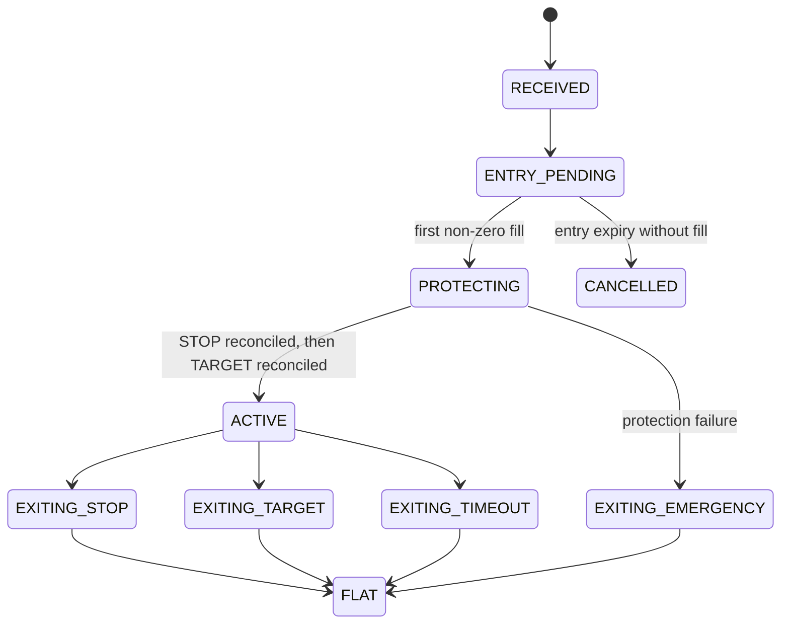
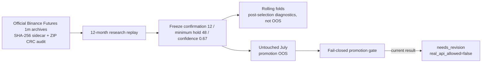
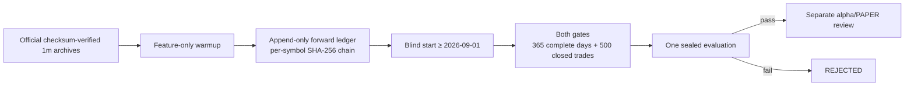

# Kairos Architecture

Kairos separates strategy generation, model review, deterministic risk and venue execution.
The strict Strategy Parity/PAPER path uses immutable, versioned `kairos-core` contracts over
Redis Streams and durable PostgreSQL inbox/outbox transactions. The older tactical route remains
available only as an explicitly selected synthetic `DRY_RUN`; it is not an alternate entrance to
PAPER or LIVE.

## Data and control flow

```mermaid
flowchart TB
    B["ClosedBarEventV1<br/>Binance UM · complete 1m bar"] --> S["Strategy Engine<br/>pure shared generator"]
    S --> I["StrategyIntentV1<br/>immutable candidate and ExitPlanV1"]
    I --> R["Router<br/>NORMAL or CONFLICT review tier"]
    R --> A["CandidateReviewV1<br/>ALLOW / VETO / DEFER · priority"]
    A --> K["Risk Manager<br/>deterministic admission and sizing"]
    K --> D["RiskTradeDecisionV1<br/>NEXT_BAR_MARKET"]
    D --> E["Execution FSM<br/>journal and recovery barrier"]
    E --> N["Node 22 sidecar<br/>official EVEDEX SDK 1.2.11"]
    N --> X["EVEDEX DEV<br/>fills · SL · TP · timeout"]

    T["Text Scouts<br/>typed news and social evidence"] -.-> R
    M["Macro allocation"] -.-> K
    V["VenueQualityV1<br/>basis · spread · depth · age"] -.-> K
    C["AccountSnapshotV2<br/>fresh and reconciled"] -.-> K
```



The central solid path is the only mutation authority in PAPER. Dashed inputs are bounded
context or gates; none can change the intent's side, stop, target or timeout. Account feedback,
system control and operational metrics are documented separately below so the primary decision
path stays readable.

| producer | topic / contract | consumer / purpose |
| --- | --- | --- |
| Quant Scouts | `kairos.market.closed_bar.v1` / `ClosedBarEventV1` | Strategy Engine candidate input |
| Strategy Engine | `kairos.strategy.intent.v1` / `StrategyIntentV1` | Router |
| Router | `kairos.strategy.route.v1` / `CandidateRouteV1` | Aggregator review |
| Aggregator | `kairos.aggregator.review.v1` / `CandidateReviewV1` | Risk |
| Quant venue poller | `kairos.venue.quality.v1` / `VenueQualityV1` | Risk and durable TCA |
| Risk | `kairos.risk.trade_decision.v1` / `RiskTradeDecisionV1` | PAPER Execution |
| Execution | `kairos.execution.trade_event.v1` / `TradeExecutionEventV1` | durable lifecycle audit |
| Execution | `kairos.account.snapshot.v2` / `AccountSnapshotV2` | Risk, Macro and readiness metrics |

## 1 — Closed market data and venue observations

Quant Scouts publishes only final Binance USD-M one-minute bars. `ClosedBarEventV1` contains the
complete OHLCV payload, quote volume, taker-buy volumes, source venue and a canonical SHA-256.
REST backfill repairs recoverable gaps. A missing, reordered or conflicting bar blocks strategy
generation for that symbol instead of silently manufacturing a continuous series.

The same service continuously compares Binance reference prices with executable EVEDEX DEV books
for BTC, ETH, SOL, BNB and XRP. Each scheduled poll writes an attempt and one terminal outcome;
`VenueQualityV1` preserves basis, spread, side-specific slippage, depth, timestamps, age and
latency. Missing polls count against 24-hour availability rather than disappearing from the
denominator.

Text Scouts is an independent evidence path. It ingests GDELT/RSS and official X accounts,
durably tracks cursors and reserves spend before paid calls. DeepSeek Flash extracts compact
typed evidence; provider failure falls back to a local low-confidence classifier. Text never
creates a side or an order.

## 2 — One strategy implementation for research and runtime

`kairos-strategy-engine` owns pure generators. Their only inputs are complete closed bars and an
explicit immutable configuration; they cannot read wall-clock time, randomness, secrets, an LLM
or an exchange. `kairos-backtest` imports these same generators rather than keeping research-only
copies.

An intent fixes the strategy/revision, side, eligibility, expiry, reference price and one
`ExitPlanV1`: one stop, one target and one timeout. Its deterministic identity includes canonical
code, configuration, input-window and feature fingerprints. Frozen parity fixtures require the
same ordered intent bytes and IDs from Windows replay and Linux runtime.

All previous sleeves retain their recorded `REJECTED` results. One exact revision,
`regime_aligned_right_tail_v1`, is `FORWARD_FROZEN`; the PAPER strategy allow-list is still empty
and runtime refuses to enable either rejected sleeves or the merely forward-frozen candidate. The separate
one-shot `technical-canary@1` is manually armed and proves plumbing, not profitability.

## 3 — Candidate review, not candidate invention

The Router carries the complete intent unchanged and deterministically selects `NORMAL` or
`CONFLICT` from candidate-specific text evidence. The Aggregator's strict schema contains only
review decision, priority and reason codes:

- normal review: GPT-5.6 Luna, `medium`;
- conflict review: GPT-5.6 Terra, `high`;
- allowed outputs: `ALLOW`, `VETO` or `DEFER`.

The model cannot change side, stop, target, timeout, entry window or provenance. `DEFER`, malformed
output, provider error or deadline miss terminates the current intent without a second paid call;
a later closed bar may create a new intent. Priority only orders otherwise eligible competing
candidates and never changes quantity.

Macro Strategist uses GPT-5.6 Sol at `xhigh` to produce portfolio allocation and shock context.
Risk treats that output as a cap, not an instruction to alter a candidate. Text extraction uses
DeepSeek V4 Flash 0731 in non-thinking mode. All paid calls reserve their worst-case envelope in
the shared durable budget ledger before network I/O; technical canaries start none of these paid
services.

## 4 — Deterministic risk and EVEDEX gate

PAPER Risk accepts only an unchanged `ALLOW` review, a fresh `VenueQualityV1`, a fresh reconciled
`AccountSnapshotV2`, a compatible Macro allocation and the exact EVEDEX DEV mapping:

| Binance signal | EVEDEX DEV instrument |
| --- | --- |
| `BTCUSDT` | `BTCUSD:DEV` |
| `ETHUSDT` | `ETHUSD:DEV` |
| `SOLUSDT` | `SOLUSD:DEV` |
| `BNBUSDT` | `BNBUSD:DEV` |
| `XRPUSDT` | `XRPUSD:DEV` |

The entry policy is fixed as `NEXT_BAR_MARKET`: a decision formed from a closed bar becomes
eligible only on the next one-minute boundary and expires if the bounded entry window is missed.
Sizing uses executable EVEDEX top-of-book and loss at the immutable stop:

```text
risk_budget = min(0.25% * equity, 1% * equity - reconciled_open_risk - reserved_risk)
loss_per_unit = abs(worst_entry - stop) + round_trip_fees_per_unit + slippage_per_unit
quantity = risk_budget / loss_per_unit
```

Leverage, notional, measured depth/liquidity, portfolio and Macro caps can only reduce that
quantity. LLM priority, confidence and signal strength cannot increase it. PAPER permits no more
than one active idea per symbol and one globally active technical canary.

## 5 — Protected PAPER lifecycle

Execution consumes only `RiskTradeDecisionV1` in PAPER. It persists the trade and every external
effect before mutation, uses deterministic client order IDs and serializes all exit races under a
database trade lock.



The timeout starts at the first non-zero fill. A partial fill is protected immediately and its
unfilled entry remainder is cancelled at expiry. Execution creates and reconciles the stop before
the target. A stop failure triggers emergency close; a target failure closes while the verified
stop remains active. Authoritative reconciliation decides TP/SL/timeout races and prevents a
second close.

Python owns the durable FSM, journal and recovery barrier. An internal Node 22 child owns SIWE,
serialized auth refresh, signing, REST and WebSocket through official
`@evedex/exchange-bot-sdk` 1.2.11. It exposes no host port and never retries a mutation on its
own. On restart, new entries remain blocked until journal effects, orders, positions and TP/SL
have been reconciled. Break-even moves, trailing, multi-TP and any protective-order update are
outside this plan version.

## 6 — Persistence, operations and recovery

Redis Streams are at-least-once transport. Every consumer claims a persistent inbox row, commits
domain facts and outbox messages in one PostgreSQL transaction, and only then ACKs Redis. An
outbox dispatcher retries independently; deterministic identities reject same-ID/different-byte
replays.

The execution journal handles the non-transactional venue boundary: `PREPARED` is committed
before the call, then confirmed or authoritatively reconciled. Trade FSM transitions, public
`TradeExecutionEventV1` facts and outbox rows commit atomically. Durable storage also covers bars,
intents, reviews, risk decisions, fills, venue quality/TCA, account snapshots and day-start/peak
equity.

The isolated Compose project is exactly `kairos-paper`, with separate Redis, TimescaleDB, volumes
and secret names. PAPER accepts only EVEDEX DEV URLs/chain/instruments and a dedicated account;
application containers cannot mount arbitrary host paths. Monitoring exposes gaps, venue
availability, inbox/outbox leases, unprotected exposure, auth age, mutation reserve,
reconciliation drift, execution shortfall and API spend. Backup/restore verifies critical row
counts and public event sequence in a separate drill database.

## Legacy DRY_RUN boundary

The older `MarketSnapshot -> RouterDecision -> TacticalCommand -> ValidatedOrder ->
ExecutionReport` route remains unchanged for synthetic `DRY_RUN` compatibility. It does not use
the strict PAPER lifecycle and is never accepted by PAPER. The retired
`KAIROS_DRY_RUN=false` switch is a startup error, not an alias for PAPER or LIVE. `LIVE` is also a
startup error in the current release.

`kairos-backtest` provides deterministic historical replay and fill modelling. It is not a full
live-stack test and cannot qualify authentication, venue semantics, latency or operational
recovery.

## Offline strategy validation and promotion boundary

The offline campaign governed by
[ADR 9](adr/0009-offline-strategy-promotion-gate.md) separates parameter research from promotion
evidence:



Replay timing is causal. A decision formed from closed-candle data becomes eligible at the first
subsequent open; the fill-capacity model uses the previous closed candle's volume. IOC fill
attempts, partial fills, fill ratios, terminal liquidation and finite aggregate statistics are
retained as promotion evidence. Actual historical funding was unavailable and is never replaced
by an assumption for promotion eligibility.

| evidence | baseline | stress |
| --- | ---: | ---: |
| 12-month research replay | -4.231727849843687% / 803 trades | -9.763199273155571% / 804 trades |
| untouched July promotion OOS | -1.075965871769744% / 69 trades | -1.5781050811020259% / 69 trades |

July's buy-and-hold benchmark was +6.828606504564661%, and zero of five symbols were positive.
Promotion remains blocked by insufficient OOS trades, non-positive return/expectancy, benchmark
underperformance, unavailable historical funding, non-positive sensitivity results, and an
upstream archive anomaly/gaps/incomplete coverage. These results are offline research evidence;
they are not live-stack or venue qualification.

### Current immutable forward candidate

Trial 15 keeps the daily right-tail direction, 2 ATR stop, 4R target and 72-hour timeout, then
requires the latest complete 4-hour close to agree with SMA200. It passed a single preregistered
reused-data comparison, so its only permission is read-only future observation. It is not alpha
and cannot flow into Router, Risk or Execution.



The executable plan hash is
`38fe7512b4e4c318e5bc8dd6baa66b48eedd63112a4a447eaaf36c1175f623e8`. The observer normalizes
strict closed bars to the frozen field profile, permanently blocks gaps/reorders/conflicts,
withholds performance before eligibility and owns no exchange, LLM, feed or order route. Backup
uses SQLite's online backup API and recovery restores only to a new path before comparing sealed
evidence fingerprints.

## Verification boundary

`TECHNICAL_PAPER_READY=true` is limited to the exact pinned revision set passing its code,
contract, parity, fault/race, Windows, Docker integration and GitHub CI gates. It does not mean
that any elapsed or external qualification has passed.

`PAPER_QUALIFIED=false`: authenticated EVEDEX DEV reconciliation and venue semantics, the
24-hour read-only gate, the manually armed five-symbol protected canary set, and the seven-day
soak remain pending. `ALPHA_READY=false` and runtime `REJECT_ALL` remain independent because the
only surviving candidate is merely `FORWARD_FROZEN` and has not passed its future-data gate.
`LIVE_READY=false`; production endpoints, credentials and mutation
authority remain blocked. The exact evidence boundary and reviewed SHAs are in
[READINESS.md](READINESS.md).
