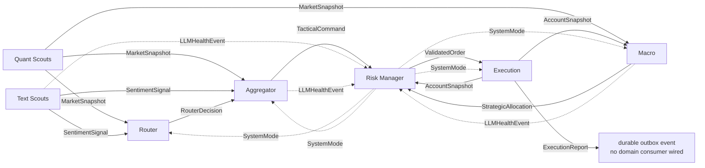
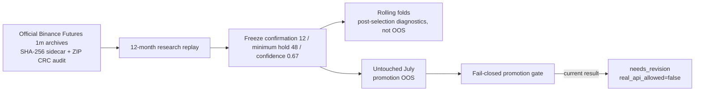

# Kairos Architecture

Kairos consists of six independently deployable runtime layers plus shared LLM, persistence,
backtest and deployment packages. Services exchange versioned messages from `kairos-core` over
Redis Streams. DeepSeek-V4-Flash-0731 handles high-volume text extraction; the GPT-5.6 family
uses Luna for routine tactical analysis, Terra for signal conflicts, and Sol for strategic
capital allocation.

## Data and control flow

| producer | topic / contract | implemented consumers |
| --- | --- | --- |
| Quant Scouts | `kairos.market.snapshot` / `MarketSnapshot` | Router, Aggregator, Macro |
| Text Scouts | `kairos.sentiment.signal` / `SentimentSignal` | Router, Aggregator |
| Router | `kairos.router.decision` / `RouterDecision` | Aggregator |
| Aggregator | `kairos.aggregator.command` / `TacticalCommand` | Risk |
| Macro | `kairos.macro.allocation` / `StrategicAllocation` | Risk |
| Risk | `kairos.risk.validated_order` / `ValidatedOrder` | Execution |
| Execution | `kairos.execution.report` / `ExecutionReport` | durably published; no domain consumer is wired yet |
| Execution | `kairos.account.snapshot` / `AccountSnapshot` | Risk, Macro |
| Text, Aggregator, Macro | `kairos.llm.health` / `LLMHealthEvent` | Risk |
| Risk circuit breaker | `kairos.system.control` / `SystemControl` | Router, Aggregator, Macro, Execution |

The account feedback is direct from Execution to both Risk and Macro (Risk does not forward it).
It closes two important loops: Risk refuses orders without
a recent reconciled account snapshot, and Macro includes portfolio state in strategic context.
An explicit reconciliation failure revokes previously trusted account state. Message delivery
and publication are durable; some analytical histories and bounded caches still reset with
their process.

## Layer 1 — Scouts

**Quant Scouts** use exchange WebSocket/REST inputs and pure math. Indicators are calculated
only from closed one-minute klines. Open interest is refreshed periodically, liquidation
`forceOrder` events are aggregated, and reconnect/backoff plus staleness rules prevent an open
socket from being mistaken for fresh data.

**Text Scouts** ingest GDELT/RSS and selected public accounts through the official X API,
deterministically filter the evidence, and run batched sentiment analysis using the current
`deepseek-v4-flash` alias (DeepSeek-V4-Flash-0731) in explicit non-thinking mode. X account
handles are resolved once to immutable User IDs; User-ID and Post cursors plus per-request
budget reservations are durable in PostgreSQL. A failed Flash call falls back to a local
keyword classifier with reduced confidence and publishes model health to Risk. The requested
alias and provider-resolved model metadata are kept separate so an alias rollout is observable.
All paid LLM callers reserve conservative request envelopes in shared provider-wide PostgreSQL
ledgers before contacting DeepSeek or OpenAI. Failed, cancelled and ambiguous calls retain their
reservation; a missing durable backend fails closed rather than allowing unaccounted spend.

## Layer 2 — Router

The Router is a deterministic FSM with hysteresis. Its existing wire-level lane names are
`ROUTE_PRO` for the normal lane and `ROUTE_GPT` for the conflict lane; model selection no longer
depends on those historical provider-oriented names. It escalates after four consecutive
quant/text conflicts and returns after ten calm ticks.
Redis messages are acknowledged only after required processing/publishing succeeds.

System-mode policy is risk-preserving. `LOCAL_QUANT_MODE` suppresses routing that could lead to
new exposure; it must not turn degradation into a ban on downstream close/reduce-only actions.

## Layer 3 — Aggregator

The normal workload calls GPT-5.6 Luna with `medium` reasoning effort. A conflict workload calls
GPT-5.6 Terra with `high` reasoning effort. Both paths use strict output schemas, validate
reference prices and publish replay-safe
tactical commands. In degraded/conflict states, deterministic policy can emit
`WAIT_CONFIRMATION` or reduce risk rather than opening exposure.

## Layer 4 — Macro Strategist

GPT-5.6 Sol with `xhigh` effort produces strategic allocations from actual market and account
snapshots rather than an empty hard-coded context. Shock detection uses incoming market data;
system-control broadcasts select defensive behavior. Outputs are strict-schema validated and
published with stable replay identities. Context and replay caches remain in-memory.

## Layer 5 — Risk Manager and circuit breaker

Risk deterministically applies account freshness, reconciliation, strategy allocation,
leverage, drawdown, notional and sizing rules. It is the authoritative publisher of
`SystemMode`; it does not consume its own control broadcast.

The LLM circuit breaker receives health events from Text, Aggregator and Macro. Repeated model
5xx/timeouts trigger model degradation; connection/rate-limit events also drive an aggregate
OpenAI provider breaker. Healthy validated responses reset the corresponding model and provider
breaker. Bad model output is rejected by the caller but does not prove provider unavailability.

| condition | mode | intended effect |
| --- | --- | --- |
| healthy | `NORMAL` | normal routing and risk policy |
| DeepSeek-V4-Flash unavailable | `TEXT_LOCAL_FILTER` | Text uses deterministic low-confidence fallback |
| GPT-5.6 Luna unavailable | `LOCAL_QUANT_MODE` | normal tactical hot path is detached; only protective risk reduction remains |
| GPT-5.6 Terra or Sol unavailable | `CONFLICT_SAFE` | conflict and macro paths become defensive |
| OpenAI provider or two or more model breakers unavailable | `LOCAL_QUANT_MODE` | block new exposure; permit protective close/reduce-only execution |

## Layer 6 — Execution Engine

Execution alone holds venue credentials. It consumes validated orders and system control,
reconciles positions/orders, submits through EVEDEX or CCXT adapters, and publishes execution
reports plus account snapshots at startup, periodically and after relevant actions.

EVEDEX orders are authenticated with EIP-712. Fixed exchange-hosted stop loss / take profit
orders are supported. Trailing behavior is application-managed by updating protective orders;
the project must not describe it as a verified native server-side trailing-stop facility.
Execution writes a durable `PREPARED` effect before every venue mutation and records confirmation
or reconciliation afterward. Startup recovery takes a database advisory lock, blocks new risk,
and reconciles unresolved effects. EVEDEX TP/SL recovery uses authoritative parent-order linkage
to avoid recreating an already-existing protective order. Venues without an authoritative
lookup remain fail-closed rather than guessing. External live EVEDEX behavior is still
unqualified.

## Model gateway

| component | configured model/API | role |
| --- | --- | --- |
| Text Scouts | `deepseek-v4-flash` (V4-Flash-0731), Chat Completions, non-thinking | routine text sentiment |
| Aggregator normal | GPT-5.6 Luna, OpenAI Responses, `medium` | routine tactical analysis |
| Aggregator conflict | GPT-5.6 Terra, OpenAI Responses, `high` | signal conflict |
| Macro Strategist | GPT-5.6 Sol, OpenAI Responses, `xhigh` | allocation and shock response |

OpenAI output is parsed directly into Pydantic models through the Responses API. DeepSeek JSON
is locally validated against the same strict schema. No LLM package imports the message bus;
callers publish health through an optional gateway hook. The gateway routes by explicit workload
role; `ReasoningEffort` remains part of domain output/audit contracts rather than serving as a
global model identifier.

## Delivery, replay and persistence boundary

Redis Streams provide at-least-once transport. Every runtime consumer claims a persistent inbox
row, executes domain writes and required outbox inserts in one database transaction, and only
then acknowledges the stream message. A separate dispatcher publishes committed outbox rows and
records bounded retries/dead letters. Deterministic message identities make repeated delivery
converge on the same durable record.

This closes the prior ACK/publish crash window for service-to-service messages. It does not turn
arbitrary external exchange APIs into exactly-once systems; that boundary is handled separately
by the execution-effect journal and venue reconciliation described above. A metrics exporter
reports inbox/outbox backlog and unresolved execution effects without exposing payloads.

`kairos-backtest` provides deterministic historical replay and fill modelling. It is not a
full live-stack test and cannot qualify exchange authentication, venue semantics, provider
latency, or operational recovery.

## Offline strategy validation and promotion boundary

The offline campaign governed by
[ADR 9](adr/0009-offline-strategy-promotion-gate.md) separates parameter research from promotion
evidence:

Replay timing is causal. A decision formed from closed-candle data becomes eligible at the first
subsequent open; the fill-capacity model uses the previous closed candle's volume. IOC fill
attempts, partial fills, fill ratios, terminal liquidation and finite aggregate statistics are
retained as promotion evidence. Actual historical funding was unavailable and is never replaced
by an assumption for promotion eligibility.

| evidence | baseline | stress |
| --- | ---: | ---: |
| 12-month research replay | -4.231727849843687% / 803 trades | -9.763199273155571% / 804 trades |
| untouched July promotion OOS | -1.075965871769744% / 69 trades | -1.5781050811020259% / 69 trades |

July's buy-and-hold benchmark was +6.828606504564661%, and zero of five symbols were positive.
Promotion remains blocked by insufficient OOS trades, non-positive return/expectancy, benchmark
underperformance, unavailable historical funding, non-positive sensitivity results, and an
upstream archive anomaly/gaps/incomplete coverage. These results are offline research evidence;
they are not live-stack or venue qualification.

## Verification boundary

Every Python repository uses a locked `uv` environment and Linux Python 3.11/3.14 plus Windows
CI. The meta runner repeats lock, lint, format, typing, security, unit and build checks locally
without Docker. The local Docker stack now validates durable persistence, authenticated Redis,
file-scoped secrets, loopback monitoring, explicit reconnect soak, and isolated backup/restore.
Production readiness still requires authenticated provider/live-exchange tests, canary
execution, managed secret storage, encrypted off-host backups and a substantially longer soak.
A passing strategy promotion gate is an additional prerequisite for enabling real trading APIs.
