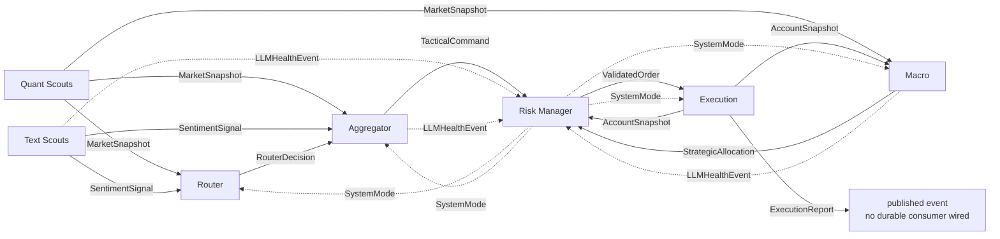

# Kairos Architecture

Kairos consists of six independently deployable runtime layers plus shared LLM, persistence,
backtest and deployment packages. Services exchange versioned messages from `kairos-core` over
Redis Streams. DeepSeek handles routine analysis; GPT-5.6 Sol is reserved for costly conflict
and strategic reasoning.

## Data and control flow

| producer | topic / contract | implemented consumers |
| --- | --- | --- |
| Quant Scouts | `kairos.market.snapshot` / `MarketSnapshot` | Router, Aggregator, Macro |
| Text Scouts | `kairos.sentiment.signal` / `SentimentSignal` | Router, Aggregator |
| Router | `kairos.router.decision` / `RouterDecision` | Aggregator |
| Aggregator | `kairos.aggregator.command` / `TacticalCommand` | Risk |
| Macro | `kairos.macro.allocation` / `StrategicAllocation` | Risk |
| Risk | `kairos.risk.validated_order` / `ValidatedOrder` | Execution |
| Execution | `kairos.execution.report` / `ExecutionReport` | published; no durable consumer is wired yet |
| Execution | `kairos.account.snapshot` / `AccountSnapshot` | Risk, Macro |
| Text, Aggregator, Macro | `kairos.llm.health` / `LLMHealthEvent` | Risk |
| Risk circuit breaker | `kairos.system.control` / `SystemControl` | Router, Aggregator, Macro, Execution |

The account feedback is direct from Execution to both Risk and Macro (Risk does not forward it).
It closes two important loops: Risk refuses orders without
a recent reconciled account snapshot, and Macro includes portfolio state in strategic context.
An explicit reconciliation failure revokes previously trusted account state. This does not yet
make the state durable: intraday PnL/history and several replay caches reset with their process.

## Layer 1 — Scouts

**Quant Scouts** use exchange WebSocket/REST inputs and pure math. Indicators are calculated
only from closed one-minute klines. Open interest is refreshed periodically, liquidation
`forceOrder` events are aggregated, and reconnect/backoff plus staleness rules prevent an open
socket from being mistaken for fresh data.

**Text Scouts** perform feed ingestion, deterministic filtering and batched sentiment analysis
using DeepSeek-V4-Flash in explicit non-thinking mode. A failed Flash call falls back to a local
keyword classifier with reduced confidence and publishes model health to Risk.

## Layer 2 — Router

The Router is a deterministic FSM with hysteresis. It normally emits `ROUTE_PRO`, escalates to
`ROUTE_GPT` after four consecutive quant/text conflicts, and returns after ten calm ticks.
Redis messages are acknowledged only after required processing/publishing succeeds.

System-mode policy is risk-preserving. `LOCAL_QUANT_MODE` suppresses routing that could lead to
new exposure; it must not turn degradation into a ban on downstream close/reduce-only actions.

## Layer 3 — Aggregator

The normal route calls DeepSeek-V4-Pro. A conflict route calls GPT-5.6 Sol with `high` reasoning
effort. Both paths use strict output schemas, validate reference prices and publish replay-safe
tactical commands. In degraded/conflict states, deterministic policy can emit
`WAIT_CONFIRMATION` or reduce risk rather than opening exposure.

## Layer 4 — Macro Strategist

GPT-5.6 Sol with `xhigh` effort produces strategic allocations from actual market and account
snapshots rather than an empty hard-coded context. Shock detection uses incoming market data;
system-control broadcasts select defensive behavior. Outputs are strict-schema validated and
published with stable replay identities. Context and replay caches remain in-memory.

## Layer 5 — Risk Manager and circuit breaker

Risk deterministically applies account freshness, reconciliation, strategy allocation,
leverage, drawdown, notional and sizing rules. It is the authoritative publisher of
`SystemMode`; it does not consume its own control broadcast.

The LLM circuit breaker receives health events from Text, Aggregator and Macro. Repeated model
5xx/timeouts trigger degradation; healthy validated responses reset the corresponding breaker.
Bad model output is rejected by the caller but does not prove provider unavailability.

| condition | mode | intended effect |
| --- | --- | --- |
| healthy | `NORMAL` | normal routing and risk policy |
| DeepSeek-V4-Flash unavailable | `TEXT_LOCAL_FILTER` | Text uses deterministic low-confidence fallback |
| GPT-5.6 Sol unavailable | `CONFLICT_SAFE` | GPT conflict/macro paths become defensive |
| two or more tracked models unavailable | `LOCAL_QUANT_MODE` | block new exposure; permit protective close/reduce-only execution |

## Layer 6 — Execution Engine

Execution alone holds venue credentials. It consumes validated orders and system control,
reconciles positions/orders, submits through EVEDEX or CCXT adapters, and publishes execution
reports plus account snapshots at startup, periodically and after relevant actions.

EVEDEX orders are authenticated with EIP-712. Fixed exchange-hosted stop loss / take profit
orders are supported. Trailing behavior is application-managed by updating protective orders;
the project must not describe it as a verified native server-side trailing-stop facility.
External live EVEDEX behavior remains unqualified.

## Model gateway

| component | configured model/API | role |
| --- | --- | --- |
| Text Scouts | DeepSeek-V4-Flash, Chat Completions, non-thinking | routine text sentiment |
| Aggregator normal | DeepSeek-V4-Pro, Chat Completions, non-thinking | routine tactical analysis |
| Aggregator conflict | GPT-5.6 Sol, OpenAI Responses, `high` | signal conflict |
| Macro Strategist | GPT-5.6 Sol, OpenAI Responses, `xhigh` | allocation and shock response |

OpenAI output is parsed directly into Pydantic models through the Responses API. DeepSeek JSON
is locally validated against the same strict schema. No LLM package imports the message bus;
callers publish health through an optional gateway hook.

## Delivery, replay and persistence boundary

Consumers acknowledge only after full success and use deterministic message identities and
replay caches. Redis Streams still provide at-least-once delivery. `kairos-persistence` now has
Timescale migrations and transactional inbox/outbox repositories, but these primitives are not
wired into all service publish/ACK paths. Therefore end-to-end durable exactly-once processing,
restart-safe deduplication, and a complete audit trail are not yet guaranteed.

`kairos-backtest` provides deterministic historical replay and fill modelling. It is not a
full live-stack test and cannot qualify exchange authentication, venue semantics, provider
latency, or operational recovery.

## Verification boundary

Every Python repository uses a locked `uv` environment and Linux Python 3.11/3.14 plus Windows
CI. The meta runner repeats lock, lint, format, typing, security, unit and build checks locally
without Docker. Production readiness additionally requires durable persistence integration,
external provider/live-exchange tests, canary execution, soak/reconnect testing, secret-store
deployment and operational backup/restore exercises.
